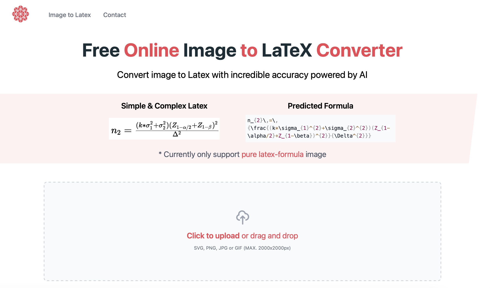

# Image-to-Latex Web application from scratch

## <a href="https://react-landing-page-template-2021.vercel.app/"> LIVE DEMO</a>



### Description

The goal of this project is to show you how to Image-to-Latex Web application by your own OCR model from scratch

### Step1. Training a image-to-latex OCR using machine learning

Latex formulas are trained on the base [**LaTeX-OCR**](https://github.com/lukas-blecher/LaTeX-OCR) model. I add additional data to improve the model's ability to recognize LaTeX expressions, especially for Matrix and Align. 

### Step2. Create a frontend web page 

This project use [**react-landing-page-template-2021**](https://github.com/samanthajiang/react-landing-page-template-2021) 
as the base template. See deploy instruction in the original repository.

### Step3. Create a backend api

How to show prediction result on the webpage? [**Flask**](https://github.com/pallets/flask) serves as api to connect frontend and backend. See `backend/pix2tex/api/app.py` and `src/components/Upload_image.tsx` to see how frontend and backend communicate.

### Step4. Deploy on the web

### Step5. SEO

### Step6. GoogleAd

This project use [**react-landing-page-template-2021**](https://github.com/samanthajiang/react-landing-page-template-2021) 
as the base template. See deploy instruction in the original repository.

- 📱  Responsive design
- 🔥 [Next.js](https://nextjs.org) for Static Site Generator

- 🎨 Integrate with [Tailwind CSS](https://tailwindcss.com) (w/ JIT mode)

- 💅 PostCSS for processing Tailwind CSS and integrated to `styled-jsx`

- 🎉 Type checking [TypeScript](https://www.typescriptlang.org)

- 🗂 VSCode configuration: Debug, Settings, Tasks and extension for PostCSS, ESLint, Prettier, TypeScript

- 🤖 SEO metadata, JSON-LD and Open Graph tags with Next SEO

- 🖱️ One click deployment with Vercel or Netlify (or manual deployment to any hosting services)

Built-in feature from Next.js:

- ☕ Minify HTML & CSS
- 💨 Live reload
- ✅ Cache busting

### Make it your own

#### 1. Clone repo

```
git clone https://github.com/issaafalkattan/react-landing-page-template-2021.git
cd react-landing-page-template-2021
yarn
```

Then, you can run locally in development mode with live reload:

```
yarn dev
```

Open <http://localhost:3000> with your favorite browser to see your project.

#### 2. Add your own content

 1. **Content**: change the configuration in the ```src/config/index.json``` file to change the content of the landing page to match your use ```src/config/index.json```  folder and .
 2. **Images**:  add any images/icons..etc to the ```public/assets/images```  folder and update their reference source in ```src/config/index.json```.
 3. **Theme**:  to change the theme, update the ```tailwind.config.js```  file to match the theme of your branding. [Tutorial](https://tailwindcss.com/docs/configuration).

#### 3. Deploy to production

[](https://vercel.com/new/clone?repository-url=https%3A%2F%2Fgithub.com%2Fissaafalkattan%2Freact-landing-page-template-2021)

##### Deploy manually

You can see the results locally in production mode with:

  ```
yarn build
yarn start
```

The generated HTML and CSS files are minified (built-in feature from Next js). It will also removed unused CSS from [Tailwind CSS](https://tailwindcss.com).

You can create an optimised production build with:

```
yarn build-prod
```

### Contributions

Everyone is welcome to contribute to this project. Feel free to open an issue if you have question or found a bug.

### License

Licensed under the MIT License, Copyright © 2021
  

## Liked this template? <a href="https://www.buymeacoffee.com/issaaf">Buy me a coffee ☕️</a>


---

### Looking for v1? <a href="https://github.com/issaafalkattan/React-Landing-Page-Template">V1</a>
